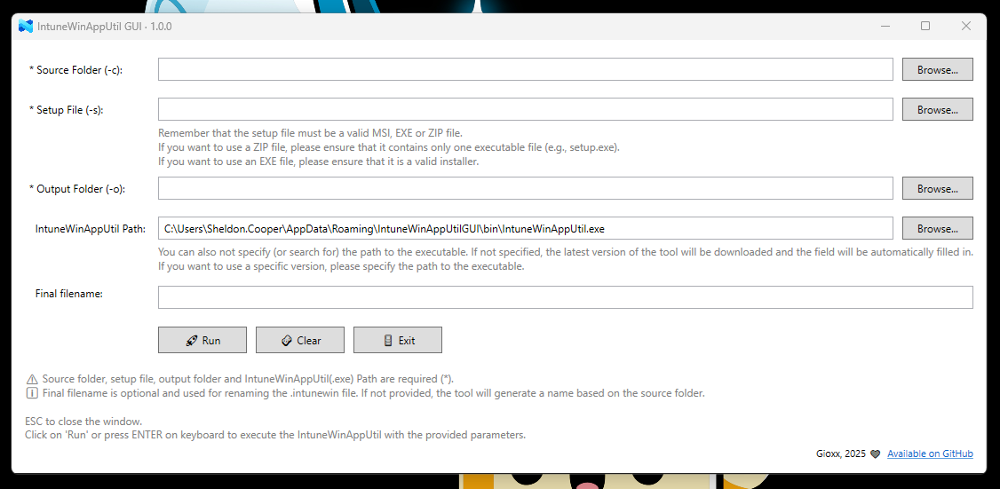

# IntuneWinAppUtil GUI

**A PowerShell-based graphical user interface for Microsoft's IntuneWinAppUtil.exe.**  


This tool simplifies the packaging of Win32 apps for Microsoft Intune by providing a modern and easy-to-use WPF interface, including automation, validation, and configuration persistence.



---

## 🔧 Features

- Built with **WPF** (XAML) and **PowerShell** — no external dependencies.
- Automatically stores tool path and reuses it on next launch (saved in a JSON file, check "[Configuration file](#%EF%B8%8F-configuration-file)").
- Graphical interface for all required options (`-c`, `-s`, `-o`).
- **Auto-download** of the latest version of `IntuneWinAppUtil.exe` from GitHub (optional).
- It detects the use of PSAppDeployToolkit and automatically proposes executable file and final IntuneWin package name.
- Sanitizes invalid characters from the output filename.

---

## 🧰 Requirements

- Windows 10 or later.
- PowerShell 5.1 or higher.
- .NET Framework 4.7.2 or higher (usually already installed on supported systems).

---

## 🚀 How to Use

### Method 1: From PowerShell Gallery (recommended)

Once published, you'll be able to install via:

```powershell
Install-Module IntuneWinAppUtilGUI -Scope CurrentUser
Show-IntuneWinAppUtilGUI
```

### Method 2: Clone or Download

1. Clone this repository or download as ZIP and extract (e.g., `C:\IntuneWinAppUtilGUI`)..
2. In PowerShell, import the module from the extracted folder:

    ```powershell
    Import-Module "C:\IntuneWinAppUtilGUI\IntuneWinAppUtilGUI.psm1"
    ```

3. Then launch the tool with:

    ```powershell
     Show-IntuneWinAppUtilGUI
    ```

> 💡 Tip: you can add the module path to your `$env:PSModulePath` if you want to make it persist and available system-wide.

---

## 📦 Fields Explained

| Field                  | Required | Description |
|------------------------|----------|-------------|
| **Source Folder (-c)** | ✅ Yes   | The root folder containing your setup file. |
| **Setup File (-s)**    | ✅ Yes   | The installer (EXE, MSI, or ZIP). If in same folder, only the filename is shown. |
| **Output Folder (-o)** | ✅ Yes   | Where the `.intunewin` package will be created. |
| **IntuneWinAppUtil**   | ✅ Yes\* | You can specify the path manually or let the GUI download the latest version automatically. |
| **Final Filename**     | Optional | Renames the generated `.intunewin` file. Invalid characters are removed automatically. |

\* The field is optional only if the tool is not yet downloaded — the GUI will handle this.

---

## 🗂️ Configuration File

- A configuration file `config.json` is created in:

  ```
  %APPDATA%\IntuneWinAppUtilGUI\
  ```

- It stores only the `ToolPath` so it can be reused at next launch.
- This file is updated when the GUI closes.

---

## 🌐 Auto-download Feature

If the path to `IntuneWinAppUtil.exe` is not provided:

- The GUI will **automatically download and extract** the latest tool from:
  [https://github.com/microsoft/Microsoft-Win32-Content-Prep-Tool](https://github.com/microsoft/Microsoft-Win32-Content-Prep-Tool/releases/latest)
- The tool will be stored locally under the `%APPDATA%\IntuneWinAppUtilGUI\bin` folder.
- You can always choose to download the latest available version by simply clicking the "Force download" button.

---

## 💡 Tips

- Press **ESC** to close the window.
- Press **ENTER** to run the packaging when you are ready.
- A small tooltip message at the bottom of the GUI provides quick usage hints.
- Clear and Exit buttons are provided to reset inputs or close the app manually.

---

## 🐞 Known Issues

### Emoji rendering on Windows 10 (and earlier versions)

The graphical interface makes use of emojis (such as ✅, 🚀, 🔧, etc.) to improve visual feedback and usability.  
**On Windows 10** (also 8.1 and 7), some emojis might not be displayed correctly due to limited font support in the system’s default rendering engine. You may see missing characters or fallback symbols instead. **On Windows 11**, emoji rendering is fully supported and works as expected.

> [!IMPORTANT]  
> This is only a cosmetic issue. The script and tool functionality are not affected in any way. Everything will continue to work normally on both Windows 10 and Windows 11.
> If you would like to help me fix this problem, feel free to open a Pull Request with your integration!

---

## 🤝 Contributions

Pull requests and issues are welcome. If you have an improvement idea, feel free to open a discussion or PR!

---

## 📄 License

Licensed under the [MIT License](https://opensource.org/licenses/MIT).
