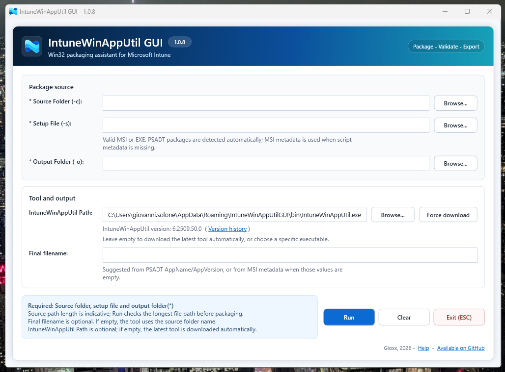

# IntuneWinAppUtil GUI

**A PowerShell-based graphical user interface for Microsoft's IntuneWinAppUtil.exe.**  


This tool simplifies the packaging of Win32 apps for Microsoft Intune by providing a modern and easy-to-use WPF interface, including automation, validation, and configuration persistence.

For additional project documentation and practical guidance, see the [IntuneWinAppUtilGUI Knowledge Base](https://kb.gioxx.org/Projects/M365/intunewinapputilgui/).



---

## 🔧 Features

- Built with **WPF** (XAML) and **PowerShell** — no external dependencies.
- **Auto-download** of the latest version of `IntuneWinAppUtil.exe` from GitHub (optional).
- Automatically stores tool path and reuses it on next launch (saved in a JSON file, check "[Configuration file](#%EF%B8%8F-configuration-file)").
- Command-line helpers for checking executable versions and building Intune detection rules.
- Graphical interface for all required options (`-c`, `-s`, `-o`).
- It detects the use of PSAppDeployToolkit and automatically proposes the setup file and final IntuneWin package name, including MSI-backed packages.
- Live path length indicator for Source/Output folders, with a final max-path check at Run time.
- Optional update check on startup with a non-blocking UI banner.
- Sanitizes invalid characters from the output filename.
- Uses Windows-version-safe UI labels instead of emoji glyphs in the WPF interface.

---

## 🧰 Requirements

- Windows 10 or later (Windows 11 is recommended).
- PowerShell 5.1 or higher (PowerShell 7 is recommended).
- .NET Framework 4.7.2 or higher (usually already installed on supported systems).

---

## 🚀 How to Use

### Method 1: From PowerShell Gallery (recommended)

Once published, you'll be able to install via:

```powershell
Install-Module IntuneWinAppUtilGUI -Scope CurrentUser
Show-IntuneWinAppUtilGUI
```

### Method 2: Clone or Download

1. Clone this repository or download as ZIP and extract (e.g., `C:\IntuneWinAppUtilGUI`)..
2. In PowerShell, import the module from the extracted folder:

    ```powershell
    Import-Module "C:\IntuneWinAppUtilGUI\IntuneWinAppUtilGUI.psm1"
    ```

3. Then launch the tool with:

    ```powershell
     Show-IntuneWinAppUtilGUI
    ```

> 💡 Tip: you can add the module path to your `$env:PSModulePath` if you want to make it persist and available system-wide.

---

## Check an executable FileVersion

The module also provides a command-line helper for the version value commonly used in Intune detection rules:

```powershell
Get-IntuneFileVersion -Path 'C:\Program Files\MyApp\MyApp.exe'
```

The command returns only the executable's `FileVersion`, for example `1.2.3.4`. It raises an error if the path does not exist or points to a directory.

---

## 🔍 Intune detection script

The [`Scripts/Intune_CheckAppInstallation.ps1`](Scripts/Intune_CheckAppInstallation.ps1) script can be used as a starting point for a custom Intune Win32 app detection rule. It checks both 64-bit and 32-bit `Program Files` locations and returns:

- exit code `0` when the executable is found and, when configured, meets the minimum version;
- exit code `1` when the executable is missing or its version is below the required minimum.

Before using it, edit `$searchPath` to match the relative path of the target executable:

```powershell
$searchPath = "Vendor\Application\application.exe"
```

To require a minimum version, pass it to `Get-AppStatus` near the end of the script:

```powershell
$status = Get-AppStatus -MinimumVersion "1.2.3.4"
```

To detect the file regardless of its version, leave the call without `-MinimumVersion`. The script writes a concise status message to standard output, which is useful when reviewing Intune Management Extension logs.

---

## 📦 Fields Explained

| Field                  | Required | Description |
|------------------------|----------|-------------|
| **Source Folder (-c)** | ✅ Yes   | The root folder containing your setup file. |
| **Setup File (-s)**    | ✅ Yes   | The installer (EXE or MSI, but any file works, e.g. PS1/BAT/CMD for script-based apps). If in same folder, only the filename is shown. |
| **Output Folder (-o)** | ✅ Yes   | Where the `.intunewin` package will be created. |
| **IntuneWinAppUtil**   | ✅ Yes\* | You can specify the path manually or let the GUI download the latest version automatically. |
| **Final Filename**     | Optional | Renames the generated `.intunewin` file. Invalid characters are removed automatically. |

\* The field is optional only if the tool is not yet downloaded — the GUI will handle this.

---

## 🗂️ Configuration File

- A configuration file `config.json` is created in:

  ```
  %APPDATA%\IntuneWinAppUtilGUI\
  ```

- It stores only the `ToolPath` so it can be reused at next launch.
- This file is updated when the GUI closes.
- Optional: `UpdateCheckEnabled` (boolean) to enable/disable the update check banner.

---

## 🌐 Auto-download Feature

If the path to `IntuneWinAppUtil.exe` is not provided:

- The GUI will **automatically download and extract** the latest tool from:
  [https://github.com/microsoft/Microsoft-Win32-Content-Prep-Tool](https://github.com/microsoft/Microsoft-Win32-Content-Prep-Tool/releases/latest)
- The tool will be stored locally under the `%APPDATA%\IntuneWinAppUtilGUI\bin` folder.
- You can always choose to download the latest available version by simply clicking the "Force download" button.

---

## 💡 Tips

- Use the **Help** button in the main window to review command-line switches and keyboard shortcuts.
- Press **ESC** to close the window after confirmation.
- Press **ENTER** to run the packaging when you are ready.
- A small tooltip message at the bottom of the GUI provides quick usage hints.
- Clear and Exit buttons are provided to reset inputs or close the app manually.

### Optional launch switches

```powershell
Show-IntuneWinAppUtilGUI -ShowVersion
Show-IntuneWinAppUtilGUI -ForceUpdateBanner
Show-IntuneWinAppUtilGUI -Diag
```

- `-ShowVersion` displays installed/latest module versions in the header banner.
- `-ForceUpdateBanner` simulates an update banner for testing.
- `-Diag` writes startup/shutdown diagnostics such as handles, GDI handles and memory usage.
- Standard PowerShell `-Verbose` and `-Debug` switches are preserved when the GUI relaunches itself in STA mode.

---

## 🤝 Contributions

Pull requests and issues are welcome. If you have an improvement idea, feel free to open a discussion or PR!

---

## 📄 License

Licensed under the [MIT License](https://opensource.org/licenses/MIT).
